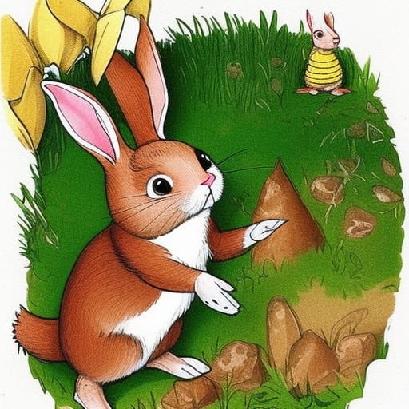

<!DOCTYPE html>
<html lang="en">
<head>
    <meta charset="UTF-8">
    <meta http-equiv="X-UA-Compatible" content="IE=edge">
    <meta name="viewport" content="width=, initial-scale=1.0">
    <title>PETER RABBIT</title>
    <link rel="stylesheet" type="text/css" href="Style2.css" />
    
    
</head>
    <body>
      <h1 style = "text-align: center;">Peter Rabbit</h1>
      

        

            
        

        

            

                Once upon a time, in a cozy little burrow, there lived a mischievous and adventurous rabbit named Peter. Peter Rabbit was always full of energy and curiosity, often getting himself into all sorts of exciting and sometimes dangerous situations.
        
        Peter lived with his loving mother, Mrs. Rabbit, and his three sisters: Flopsy, Mopsy, and Cotton-tail. They had a beautiful vegetable garden right next to their burrow. However, just beyond the garden lay Mr. McGregor's farm, which was known to be off-limits for the rabbits.
        
        Now, Mr. McGregor was a grumpy old farmer who didn't appreciate the presence of rabbits in his garden. He had set up all sorts of traps and barriers to keep the rabbits away.He nibbled on some lettuce leaves and radishes, relishing their freshness. But just as he was about to enjoy a mouthful of carrots, he heard the sound of footsteps approaching.
        
        Panicked, Peter tried to escape but found himself trapped inside a net. It was Mr. McGregor! The farmer had spotted the mischievous rabbit and had set a trap for him. Peter struggled and wriggled, desperately trying to free himself from the net.
                
        But just when all hope seemed lost, Peter's quick thinking saved the day.  He managed to slip out of the net and dashed towards the garden gate.
        He nibbled on some lettuce leaves and radishes, relishing their freshness.But just as he was about to enjoy a mouthful of carrots, he heard the sound of footsteps  approaching.
        
        Panicked, Peter tried to escape but found himself trapped inside a net. It was Mr. McGregor! The farmer had spotted the mischievous rabbit and had set a trap for him. Peter struggled and wriggled, desperately trying to free himself from the net.
        
        But just when all hope seemed lost, Peter's quick thinking saved the day. He managed to slip out of the net and dashed towards the garden gate. 

        

      

          
        

            
   

        

      

    
    

        <h2></h2>

        <textarea id="inputText" ></textarea>

        <button id="speech">Listen to story</button>
      <button id="stopSpeech">Stop</button>
         
    

    
</body>
</html>
